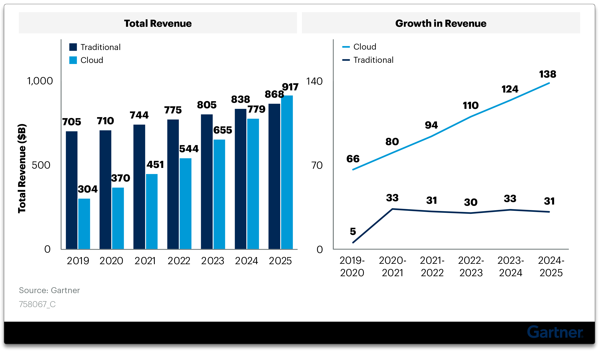
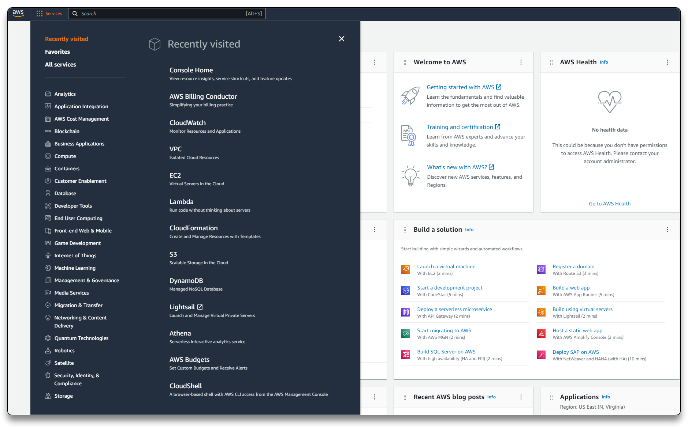
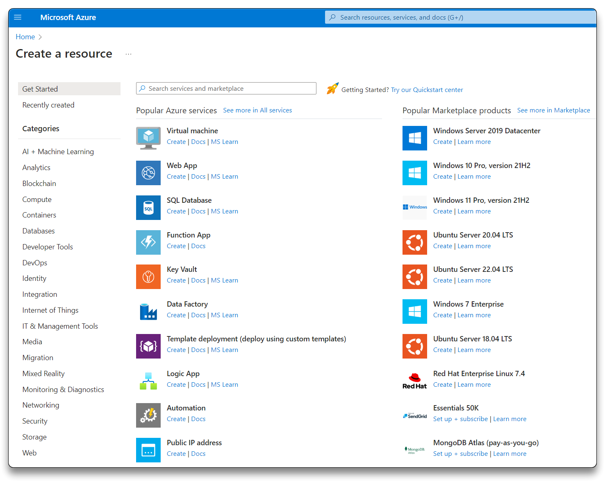
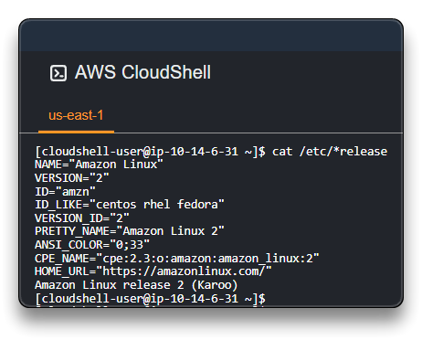

# Cloud Foundations

> #### 📕 Learning Objectives
>
> * Define **cloud** and identify cloud services and providers

📍 ***The cloud is just someone else's computer.***

## Basics

| On-Premises Information System Architecture |                                   |
| :-----------------------------------------: | --------------------------------- |
|              Physical Facility              | Cost of space, Physical Security  |
|           Physical Infrastructure           | Network, Power, Racks, Storage    |
|               Virtualization                | Platforms, Maintenance, Licensing |
|              Virtual Machines               |                                   |
|                  Services                   |                                   |
|                  Workload                   |                                   |

Cloud Architecture is the same as the above on-premises architecture, but it takes care of the physical infrastructure by providing it with built in security and redundancy at a large scale.

In addition, the **management plane** relates to the management and control of the cloud infrastructure and services, with key functions like monitoring, resource provisioning/allocation, configuration, security controls, troubleshooting, etc.

|   Cloud Architecture    |
| :---------------------: |
|    Physical Facility    |
| Physical Infrastructure |
|     Virtualization      |
|    Management Plane     |
|    Virtual Machines     |
|        Services         |
|        Workload         |

### Types of Cloud Services

**Workload level** - *Software as a Service (SaaS)*

- **SaaS** - software applications are delivered over the internet as a service (e.g. Google Tools, Microsoft365, etc).

**Services level** - *Platform as a Service (PaaS)*

- **PaaS** - provides a complete runtime environment for developers to build, deploy and manage applications. 

**Virtual Machine level** - *Infrastructure as a Service (IaaS)*

- **IaaS** - virtualized computing resources (virtual machines, storage, networking components) are provided by the cloud provider to users over the internet as a service.

These Cloud services types support levels of customization and can also offer a range of distinct "*as a Service*" options.

When moving from IaaS to SaaS, *ease of administration* increases and *control* is reduced, and vice versa.

Cloud services can be accessed through the Internet or via a private VPN Connection.

### Cloud Providers

> 1. Amazon Web Services (AWS)
> 2. Microsoft Azure
> 3. Google Cloud Platform (GCP)
> 4. IBM Cloud
> 5. Oracle Cloud Infrastructure (OCI)
> 6. Alibaba Cloud
> 7. Salesforce Cloud
> 8. VMware Cloud
> 9. Digital Ocean
> 10. Rackspace
> 11. Cisco Cloud Services
> 12. Red Hat OpenShift
> 13. Heroku
> 14. SAP Cloud Platform
> 15. Adobe Experience Cloud
>
> (not exhaustive list)

- 🔗 About [Cloud Market Share](https://www.wpoven.com/blog/cloud-market-share/)
- 🔗 By [IDC - Worldwide Public Cloud Services Revenue and Year-over-Year Growth 2021](https://www.idc.com/getdoc.jsp?containerId=prUS49420022)

- 🔗 [Gartner Says More Than Half of Enterprise IT Spending in Key Market Segments Will Shift to the Cloud by 2025](https://www.gartner.com/en/newsroom/press-releases/2022-02-09-gartner-says-more-than-half-of-enterprise-it-spending)

#### [Amazon Web Services (AWS)](https://aws.amazon.com/what-is-aws/)

- **AWS** is a leading cloud computing platform with a market share of around 33% (Q1 2022). It operates in 31 geographic launched regions, has over 200 services, and serves diverse industries. It offers job opportunities and certifications in AWS skills and is widely adopted by [companies](https://www.mytechmag.com/companies-that-use-aws/) like Airbnb, Kellogg’s, Netflix, McDonald's, The Guardian, etc.
  - [EC2](https://docs.aws.amazon.com/AWSEC2/latest/UserGuide/concepts.html) (Elastic Compute) instance - virtual machines
  - [S3](https://docs.aws.amazon.com/AmazonS3/latest/userguide/Welcome.html) (Simple Storage Service) bucket - cloud storage space

#### [Microsoft Azure](https://azure.microsoft.com/en-us/resources/cloud-computing-dictionary/what-is-azure/)

- **Azure** is a cloud computing platform with a worldwide presence (over 60 regions) and more than 600 services. Azure serves diverse industries and is used by notable [organizations](https://www.cisin.com/coffee-break/enterprise/who-are-biggest-customers-of-the-microsoft-azure-platform.html) such as eBay, BMW and Walmart. It offers certifications for professionals in Azure technologies.
  - [Virtual Machines](https://learn.microsoft.com/en-us/azure/virtual-machines/)
  - [Storage Account](https://learn.microsoft.com/en-us/azure/storage/)

#### [Google Cloud Platform (GCP)](https://cloud.google.com/docs/overview/)

- **GCP** is a major cloud provider with a global infrastructure spanning over 70 zones and 20 regions, serving diverse industries and notable [customers](https://cloud.google.com/customers) such as Twitter and PayPal. In Q1 2021, Google Cloud reported revenue of $4.05 billion. GCP is known for its data analytics and machine learning capabilities and emphasizes sustainability. Certifications are available for professionals in GCP technologies.
  - Compute Engine API - for virtual machines
  - Cloud Storage Buckets
  - Cloud Run - containerized applications

### Why Cloud

The key advantages of choosing cloud computing are:

- Scalability - easily adjust resources based on demand.
  - capacity-based spending

- Cost Efficiency - pay only for what you use, no upfront investment.
  - **consumption-based spending** (functions, services, storage)

- Accessibility and Flexibility - access applications and data from anywhere.
- Reliability and Availability - high uptime and built-in redundancy.
  - minimized administrative overhead

- Data Security and Compliance - robust security measures and regulatory compliance.
- Disaster Recovery and Backup - automated backup and quick recovery options.
- Collaboration and Productivity - real-time collaboration and increased efficiency.
- Innovation and Agility - rapid adoption of new technologies and services.
- Green and Sustainable Computing - energy-efficient infrastructure.
- Continuous Updates and Maintenance - provider handles maintenance and updates.

🔗 [CapEx vs OpEx in Cloud Computing](https://www.cloudzero.com/blog/capex-vs-opex)

**CapEx** (Capital expenditure) - `e.g.` on-premises capacity expansion/reduction

- hardware and licensing, replace/sell equipment

**OpEx** (Operating expenses) - `e.g.` cloud-base capacity expansion/reduction

- pay for what is used, no hardware purchase
- reduce monthly cost, no upgront capital costs

*Moving to the cloud might not be a good idea in case of ongoing operational investments, regulatory compliance and data fencing.*

## Management

### Tools

- **Web based** cloud management tools
  - [AWS Console](https://console.aws.amazon.com/)
  - [Azure Portal](https://portal.azure.com)
  - [GCP Console](https://console.cloud.google.com/)
  
- Command line interface (**CLI**) and Powershell CLI
  - [AWS CLI](https://docs.aws.amazon.com/cli/latest/userguide/install-cliv2.html)
    - [PowerShell](https://docs.aws.amazon.com/powershell/latest/userguide/pstools-getting-set-up.html)
  - [Azure CLI](https://docs.microsoft.com/en-us/cli/azure/install-azure-cli)
    - [Azure PowerShell](https://learn.microsoft.com/en-us/cli/azure/choose-the-right-azure-command-line-tool)
  - [Google Cloud SDK](https://cloud.google.com/sdk)
    - [Cloud Tools for PowerShell](https://cloud.google.com/tools/powershell/docs/quickstart)
  - Cloud shell ([AWS](https://docs.aws.amazon.com/cloudshell/latest/userguide/welcome.html), [Azure](https://learn.microsoft.com/en-us/azure/cloud-shell/overview), [GCP](https://cloud.google.com/shell))

- [REST API](https://restfulapi.net/) - an **API** (Application Programming Interface) that conforms to the constraints of **REST** (Representational State Transfer) architectural style, allowing interaction with RESTful web services.
  - the cloud can be integrated into third parties management tools
  - [Google Cloud APIs](https://cloud.google.com/apis)

### Cost

## Services

## Providers