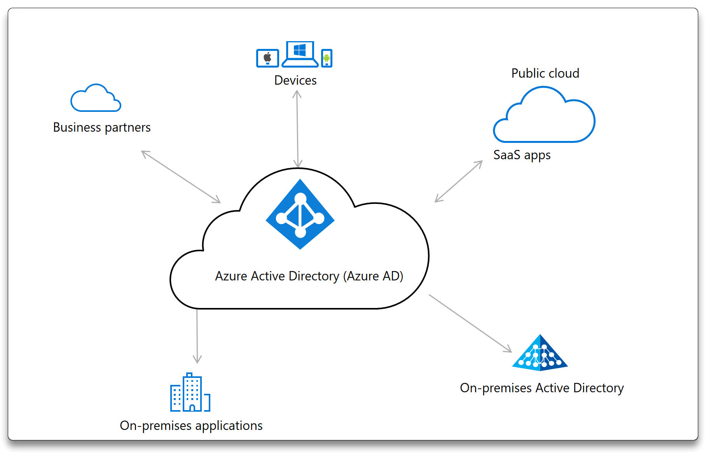
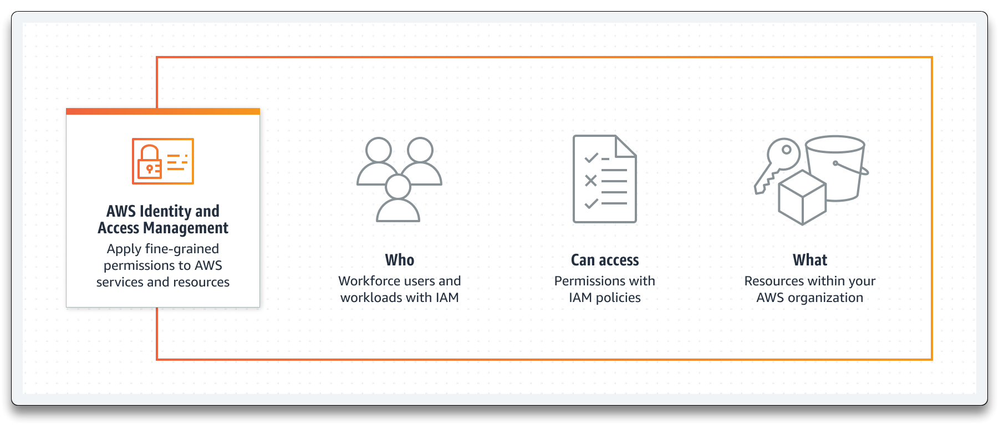
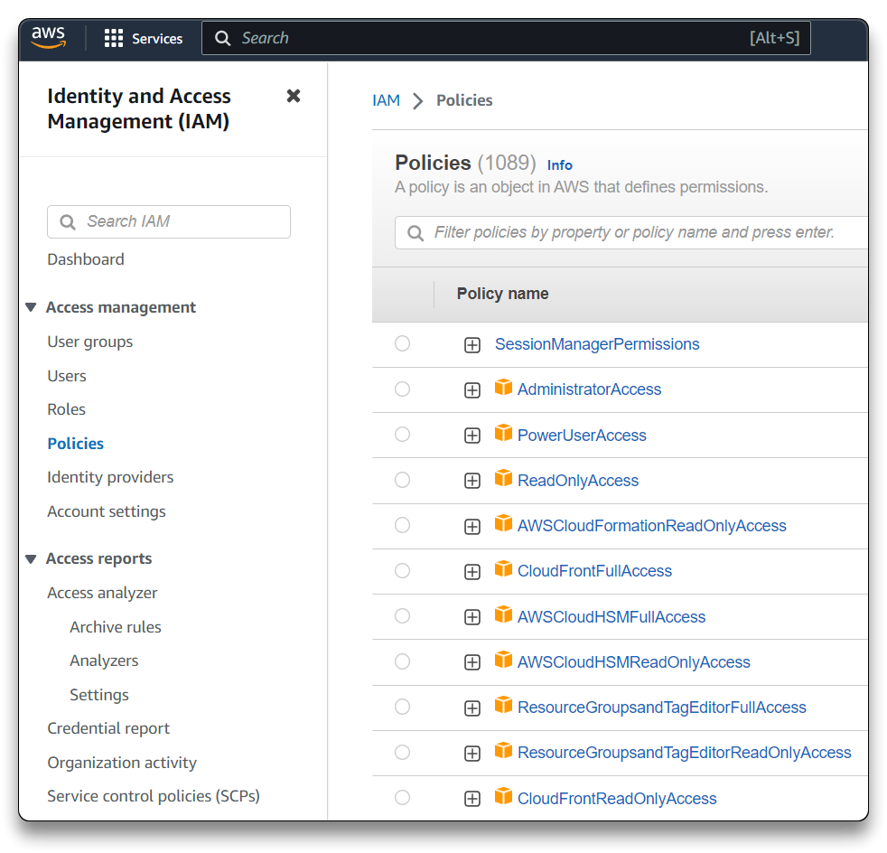

# 📒2. Cloud Management Concepts

> #### 📕 Learning Objectives
>
> * Basics aspects of managing cloud **resources** and related tasks
> * Cloud **access control** fundamentals

## Management Foundations

[Cloud **shared responsibility**](https://www.crowdstrike.com/cybersecurity-101/cloud-security/shared-responsibility-model/) refers to the distribution of security and management responsibilities between cloud service providers and cloud customers. Both the CSP and the customer have distinct roles and responsibilities to ensure the security, availability and proper management of the cloud environment and its resources.

### Management Responsibility

The **CSP** will *always be responsible for the physical facility and infrastructure, virtualization and cloud management plane*.

The **customer** is *always responsible for identities and subscription access*.

- `Customer Responsibility e.g.`
  - IaaS: *Virtual machine* (O.S.), *Services*, *Workload* (Application, Data, Service configuration)
  - PaaS: *Workload* (Application, Data, Service configuration)
  - SaaS: *Customizations* (Data, Service configuration, Usage, Identity, Access, Good practices & Compliance)

### Security Responsibility

CSP is responsible of

- Physical, Infrastructure, Platform security
- Identity system security
- ***Standards compliance***

Customer is responsible of

- Identity, Data, Application security (good practices)
- ***Standards compliance***

### Resiliency Responsibility

CSP responsibility

- Infrastructure **Resiliency**, Uptime service level agreement (SLAs)
- Service **Availability**, Disaster Recovery

Customer responsibility

- Build resilient applications and integrate CSP built-in availability and resiliency
- Implement data backup, replication, business continuity planning

> 🔗 [AWS Shared Responsibility Model for Resiliency](https://docs.aws.amazon.com/whitepapers/latest/disaster-recovery-workloads-on-aws/shared-responsibility-model-for-resiliency.html)
>

### Workload Responsibility

[Workload responsibility](https://www.cyberark.com/what-is/cloud-workload-security/) includes the tasks and considerations involved in deploying, configuring, monitoring and securing the specific applications, services and data that make up the workload.

CSP is responsible of

- SaaS out of the box workload failures (with no customization)

📌 *Effective software lifecycle management techniques are essential.*

Customer is responsible of

- Workload configuration
- App and Data security
- Monitoring and Performance

## Resource Management

> 🔗 [Resource Management Models in Cloud Computing - geeksforgeeks.org](https://www.geeksforgeeks.org/resource-management-models-in-cloud-computing/)
>

**Control Plane**

- The cloud is controlled by the **management plane**, that relates to the management and control of cloud infrastructure and services.
  - Web based console
  - REST APIs
  -  Command line tool

**Data Plane**

- **Data plane** is the cloud workload
  - VMs, Data, Applications, Services

A workload, a custom application, needs ***maintaining** of its resources like code base, data, security.*

**Monitoring**

- Provided built-in cloud tools to monitor spending, performance, automated alerting & actions
  - Applications need monitoring

**Change Management** in the cloud refers to the process of effectively managing and controlling changes to cloud-based systems, services and infrastructure, by implementing procedures and policies to ensure changes planning, testing, deployment and so on.

- Governance is critical- relevant compliance requirements, industry regulations, and organizational policies
- Documentation and tracking

### AWS

- RDS - Create database (Platform service) - Templates & Settings
  - Connectivity & Security, Monitoring, Logs, Configuration, Maintenance

### Azure

- Azure PowerShell script as [template](https://learn.microsoft.com/en-us/samples/browse/?expanded=azure&products=azure-resource-manager) (template JSON files)

## Monitoring & Alerts

Cloud **monitoring** is the process of observing, gathering and analyzing data from cloud-based applications, services and resources to guarantee their overall performance, availability, security and health.

It involves the use of monitoring tools, metrics and alerts to track and assess the behavior and state of various components within the cloud environment.

- Resource Monitoring
- System Monitoring frameworks
  - 🔗 [Azure Monitor](https://learn.microsoft.com/en-us/azure/azure-monitor/overview)
  - 🔗 [AWS CloudWatch](https://aws.amazon.com/cloudwatch/)
  - 🔗 [Google Cloud Monitoring](https://cloud.google.com/monitoring)
  - *Third parties*: [Splunk](https://www.splunk.com/en_us/solutions/cloud-monitoring.html?301=/en_us/it-operations/cloud-monitoring.html), [PRTG](https://www.paessler.com/cloud-monitoring), [Nagios](https://www.nagios.com/solutions/cloud-computing/)

**Proactive Resource management**

- Cloud **Automation** & Alerting

## Identity & Access Management

Cloud **I**dentity and **A**ccess **M**anagement (**IAM**) refers to the set of practices, policies and tools used to manage user **identities**, control **access** to cloud resources and enforce **security** measures within a cloud computing environment.

- management of user authentication, authorization, permissions

❗ **Root** user - absolute full rights on everything

**Federated** user - authenticated and authorized to access resources in a system or application through a trusted external identity provider.

> 🔗 [Google IAM](https://cloud.google.com/iam)
>
> - Users, Groups, Roles, Policies
> - Federated Users
> - Policies (User, Role, Resource, Condition)
>

> 🔗 [Azure AD](https://learn.microsoft.com/en-us/azure/architecture/identity/identity-start-here)
>
> - Users, Groups, Roles
> - Federated Users
>

> 🔗 [AWS IAM](https://aws.amazon.com/iam/)
>
> - Users, Groups, Permissions
> - Federated Users
> - Policies grant permissions (Effect, Action, Resources, Conditions)
>

------

